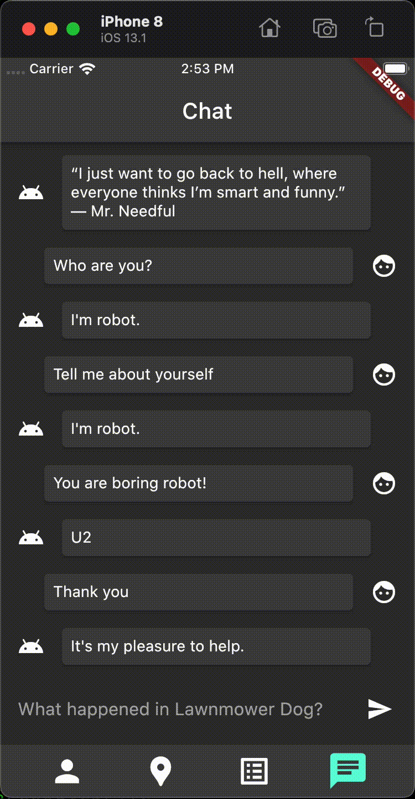

# Flutter Rimo2

![coverage][coverage_badge]
[![style: very good analysis][very_good_analysis_badge]][very_good_analysis_link]
[![License: MIT][license_badge]][license_link]

Generated by the [Very Good CLI][very_good_cli_link] 🤖

# Rick And Mory information and chat bot app

Its based on new [rickandmortyapi.com](https://rickandmortyapi.com) REST API cient library (you can find it in this repository, [packages/rimo_api](packages/rimo_api)) and custom DialogFlow agent ([docs/RiMorSe2.zip](docs/RiMorSe2.zip)). For today this agent can talk about characters and locations, can joke and supports smalltalk.
You can ask me for Firebase service accout access or create agent by yourself from .zip.

---





This is a humble example demonstrating:
* Bloc design pattern (api+repository+bloc)
* API package separation
  * full-featured [rickandmortyapi.com](https://rickandmortyapi.com) REST API client library in [packages/rimo_api](packages/rimo_api) with filters and paging support
  * light DialogFlow API client library with Firebase authentication in [packages/df_api](packages/df_api)
* [hydrated_bloc](https://pub.dev/packages/hydrated_bloc) for caching data and app state (with navigation!) using [json_annotation](https://pub.dev/packages/json_annotation) for automatic serialization
* [go_router](go_router) for navigation
* WEB ready with deep linking
* 100% code coverage for [packages/rimo_api](packages/rimo_api)
* Bloc and widget test examples

---

## Getting Started 🚀

This project contains 3 flavors:

- development
- staging
- production

To run the desired flavor either use the launch configuration in VSCode/Android Studio or use the following commands:

```sh
# Development
$ flutter run --flavor development --target lib/main_development.dart

# Staging
$ flutter run --flavor staging --target lib/main_staging.dart

# Production
$ flutter run --flavor production --target lib/main_production.dart
```

To generate code using json_serializable:
```sh
$ flutter packages pub run build_runner build
```

To generate l10n:
```sh
$ flutter gen-l10n
```

_\*Flutter Rimo works on iOS, Android, Web, and Windows._

---

## Running Tests 🧪

To check formatting and analyze code:

```sh
$ flutter format --set-exit-if-changed lib test
$ flutter analyze lib test
```

To run all unit and widget tests use the following command:

```sh
$ flutter test --coverage --test-randomize-ordering-seed random
```

To view the generated coverage report you can use [lcov](https://github.com/linux-test-project/lcov).

```sh
# Generate Coverage Report
$ genhtml coverage/lcov.info -o coverage/

# Open Coverage Report
$ open coverage/index.html
```

---

## Working with Translations 🌐

This project relies on [flutter_localizations][flutter_localizations_link] and follows the [official internationalization guide for Flutter][internationalization_link].

### Adding Strings

1. To add a new localizable string, open the `app_en.arb` file at `lib/l10n/arb/app_en.arb`.

```arb
{
    "@@locale": "en",
    "counterAppBarTitle": "Counter",
    "@counterAppBarTitle": {
        "description": "Text shown in the AppBar of the Counter Page"
    }
}
```

2. Then add a new key/value and description

```arb
{
    "@@locale": "en",
    "counterAppBarTitle": "Counter",
    "@counterAppBarTitle": {
        "description": "Text shown in the AppBar of the Counter Page"
    },
    "helloWorld": "Hello World",
    "@helloWorld": {
        "description": "Hello World Text"
    }
}
```

3. Use the new string

```dart
import 'package:flutter_rimo/l10n/l10n.dart';

@override
Widget build(BuildContext context) {
  final l10n = context.l10n;
  return Text(l10n.helloWorld);
}
```

### Adding Supported Locales

Update the `CFBundleLocalizations` array in the `Info.plist` at `ios/Runner/Info.plist` to include the new locale.

```xml
    ...

    <key>CFBundleLocalizations</key>
	<array>
		<string>en</string>
		<string>es</string>
	</array>

    ...
```

### Adding Translations

1. For each supported locale, add a new ARB file in `lib/l10n/arb`.

```
├── l10n
│   ├── arb
│   │   ├── app_en.arb
│   │   └── app_es.arb
```

2. Add the translated strings to each `.arb` file:

`app_en.arb`

```arb
{
    "@@locale": "en",
    "counterAppBarTitle": "Counter",
    "@counterAppBarTitle": {
        "description": "Text shown in the AppBar of the Counter Page"
    }
}
```

`app_es.arb`

```arb
{
    "@@locale": "es",
    "counterAppBarTitle": "Contador",
    "@counterAppBarTitle": {
        "description": "Texto mostrado en la AppBar de la página del contador"
    }
}
```

[coverage_badge]: coverage_badge.svg
[flutter_localizations_link]: https://api.flutter.dev/flutter/flutter_localizations/flutter_localizations-library.html
[internationalization_link]: https://flutter.dev/docs/development/accessibility-and-localization/internationalization
[license_badge]: https://img.shields.io/badge/license-MIT-blue.svg
[license_link]: https://opensource.org/licenses/MIT
[very_good_analysis_badge]: https://img.shields.io/badge/style-very_good_analysis-B22C89.svg
[very_good_analysis_link]: https://pub.dev/packages/very_good_analysis
[very_good_cli_link]: https://github.com/VeryGoodOpenSource/very_good_cli

# Disclaimer
I am not associated with Adult Swim and rickandmortyapi.com. All images and information about the series belong to the creators. This app is only technical demo.
